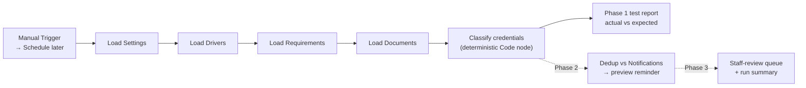

# Documinder

**Credential-expiration monitoring and renewal workflow, built in n8n.**

Documinder checks the credentials every employee must hold each day. It sends the right reminder at the right time, records every action, and routes renewals and delivery failures to a person for review. The first demo uses a trucking fleet (CDL, medical certificate, TWIC, endorsements, safety training). The data model also works for construction, healthcare, field service, legal operations, or any regulated team that tracks expiring credentials.

> **Status:** In progress. This is a portfolio build with **fictional data only**. It has no production customers and doesn't decide whether anyone is legally qualified to drive or work.

## What V1 proves

| # | Proof case | Phase | Status |
|---|---|---|---|
| 1 | Finds a document at the correct reminder stage and produces a safe **test** reminder | 1–2 | 🟡 Classification logic passes locally |
| 2 | Re-running does **not** duplicate a reminder for the same driver + document version + stage | 2 | ⬜ |
| 3 | An approved renewal creates a new document version and closes reminders for the old one | 4 | ⬜ |
| 4 | A failed or uncertain email delivery shows up for staff review instead of failing silently | 3 | ⬜ |

## How it works



**Workflow A (daily review):** load settings → active drivers → role requirements → latest *verified* document version → validate the date → count whole calendar days remaining in the business timezone → classify → work out the due reminder stage → check notification history → send a preview → record the result → route failures → print a run summary.

**Workflow B (renewal intake):** a renewal is submitted → stored as `pending_review` → a reviewer approves or rejects it → on approval, the old version is archived, a new verified version is created, and the old version's reminders are closed. On rejection, the verified document is left unchanged and the reason is recorded.

### Reminder policy

| Days remaining | State | Stage | Action |
|---|---|---|---|
| > 90 | `current` | — | none |
| 61–90 | `approaching_expiry` | `D90` | first reminder |
| 31–60 | `approaching_expiry` | `D60` | follow-up |
| 15–30 | `urgent` | `D30` | reminder |
| 8–14 | `urgent` | `D14` | reminder |
| 1–7 | `critical` | `D7` | final pre-expiry reminder |
| 0 | `expires_today` | `D0` | driver notice + staff escalation |
| < 0 | `overdue` | `OVERDUE` | staff escalation once, no repeated emails |

The workflow also flags `missing`, `invalid_date`, `inactive_skipped`, and `not_applicable`. "Not required for this role" is a different result from "required but missing."

### Safety rules

- **No LLM decides dates.** Classification is plain date math in [`src/documinder-core.js`](src/documinder-core.js), and the same code runs inside the n8n Code node.
- **Fixed test date.** The fixed date (`2026-10-15`, `America/Los_Angeles`) is used until all tests pass.
- **Missed stages aren't replayed.** Only the current stage is sent. A driver found at 45 days gets `D60`, never `D90` and `D60` together.
- **Endorsements never get invented dates.** An endorsement with no expiration date inherits the CDL date, and the output records that it did (`inherited_from_cdl:DOC…`).
- **Dedup key:** `driver_id + document_id + document_version + reminder_stage`.
- **Timeouts and unknown provider responses count as `uncertain`.** They are never retried automatically.
- **Preview mode** sends every message only to the designated test inbox.
- The scheduled workflow stays **unpublished** until every test case passes.

## Repo layout

```
docs/                     Build brief, setup guide, data model, test plan, case study
data/fixtures/            Fictional drivers, requirements, documents, settings (CSV + JSON)
src/documinder-core.js    Deterministic classification engine (shared with n8n)
tests/                    Node test suite: every fixture vs its expected result
scripts/                  Fixture generator and n8n data-table loader
workflows/                Exported n8n workflow JSON
```

## Run it

```bash
npm test
```

This runs the classification engine against all 84 expected fixture rows (12 drivers × 7 credential types). It needs Node 20 or later and has no dependencies.

To run the n8n side locally and connect Claude Code through n8n's built-in MCP server, see [docs/setup.md](docs/setup.md).

## Build phases

- [ ] **Phase 1, classification engine.** Data tables, fixtures, days-remaining math, and classification. Exit check: every fixture classifies correctly on repeated runs.
- [ ] **Phase 2, safe reminder preview.** Notification history and dedup. Exit check: the second identical run creates zero duplicates.
- [ ] **Phase 3, reliability.** Success, failure, and uncertain outcomes, a staff-review queue, and a run summary.
- [ ] **Phase 4, renewal loop.** Versioning, approve/reject, and closing reminders for superseded versions.
- [ ] **Phase 5, portfolio evidence.** A 3–5 minute demo and a one-page [case study](docs/case-study.md).

## Tools

n8n (self-hosted, Data Tables, Code node) · JavaScript · Node test runner · Claude Code with the n8n MCP server · GitHub

## License

MIT. All names, emails, and documents in this repo are fictional.
