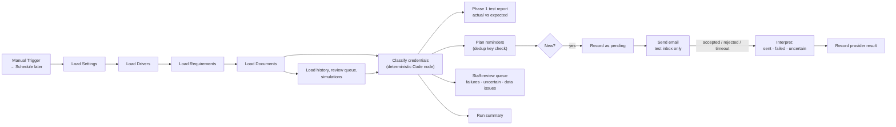

# Documinder

[](https://github.com/novaboostlabs/documinder/actions/workflows/test.yml)

**Credential-expiration monitoring and renewal workflow, built in n8n.**

Documinder checks the credentials every employee must hold each day. It sends the right reminder at the right time, records every action, and routes renewals and delivery failures to a person for review. The first demo uses a trucking fleet (CDL, medical certificate, TWIC, endorsements, safety training). The data model also works for construction, healthcare, field service, legal operations, or any regulated team that tracks expiring credentials.

> **Status:** In progress. This is a portfolio build with **fictional data only**. It has no production customers and doesn't decide whether anyone is legally qualified to drive or work.

## What V1 proves

| # | Proof case | Phase | Status |
|---|---|---|---|
| 1 | Finds a document at the correct reminder stage and produces a safe **test** reminder | 1–2 | ✅ Classification (84/84) and test-inbox previews in n8n |
| 2 | Re-running does **not** duplicate a reminder for the same driver + document version + stage | 2 | ✅ Run 1: 9 created · runs 2–3: 0 created, 9 skipped |
| 3 | An approved renewal creates a new document version and closes reminders for the old one | 4 | ⬜ |
| 4 | A failed or uncertain email delivery shows up for staff review instead of failing silently | 3 | ✅ Failure → retried · timeout → held · both queued |

## See it without installing anything

| What | Where |
|---|---|
| The n8n workflow (import it into any n8n 2.x) | [`workflows/daily-review.json`](workflows/daily-review.json) |
| The classification logic in the **Classify Credentials** node | [`src/documinder-core.js`](src/documinder-core.js) |
| A real n8n run: 84/84 checks passed | [`docs/evidence/phase1-test-report.json`](docs/evidence/phase1-test-report.json) |
| Dedup proof: 3 runs, 9 previews created once, 0 duplicates | [`docs/evidence/phase2-dedup-report.json`](docs/evidence/phase2-dedup-report.json) |
| Reminder templates and dedup logic | [`src/documinder-reminders.js`](src/documinder-reminders.js) |
| Delivery proof: 7 real sends, a simulated failure, and a simulated timeout over 2 runs | [`docs/evidence/phase3-delivery-report.json`](docs/evidence/phase3-delivery-report.json) |
| Provider-outcome rules and staff-review queue | [`src/documinder-delivery.js`](src/documinder-delivery.js) |
| Every fixture and its expected result | [`docs/test-plan.md`](docs/test-plan.md) |
| How Claude Code built and tested the workflow through n8n's MCP server | [`docs/setup.md`](docs/setup.md) · [`scripts/n8n-mcp.mjs`](scripts/n8n-mcp.mjs) |

**Phase 3 result:** reminders are sent for real through Gmail SMTP, always to the test inbox while `preview_only` is on. Two outcomes were simulated to test the edge cases:

| | Run 1 | Run 2 |
|---|---|---|
| 7 normal reminders | `sent` (Gmail message IDs recorded) | skipped as duplicates |
| Luis Alvarez: provider **rejects** (550) | `failed` → staff review (medium) | **retried automatically** |
| Taylor Morgan: provider **times out** | `uncertain` → staff review (**high**) | **held**: never auto-resent |
| Missing TWIC, invalid date | queued for staff review | not queued again |

**Phase 2 result:** on the first run, the 9 due stages (D90, D60, D30, D14, D7, and three D0s, since Casey Brooks's two endorsements share the CDL date, plus one OVERDUE) each produced a preview addressed only to the test inbox. The second and third identical runs produced **0** new reminders and skipped all 9 as duplicates.

**Phase 1 result** (n8n execution, reference date 2026-10-15, America/Los_Angeles):

| Driver | Credential | Days left | Result |
|---|---|---|---|
| Maya Torres | CDL | 156 | `current`, no reminder |
| Jordan Lee | Medical cert (v2; v1 archived) | 90 | `approaching_expiry` · **D90** |
| Chris Bennett | TWIC | 60 | `approaching_expiry` · **D60** |
| Renee Patel | Hazmat endorsement | 30 | `urgent` · **D30** |
| Luis Alvarez | Medical cert | 14 | `urgent` · **D14** |
| Taylor Morgan | TWIC | 7 | `critical` · **D7** |
| Casey Brooks | CDL (+ endorsements inherit its date) | 0 | `expires_today` · **D0** |
| Morgan Reed | Medical cert | −5 | `overdue` · **OVERDUE** |
| Jamie Kim | CDL | — | `inactive_skipped` |
| Avery Johnson | Hazmat endorsement | — | `not_applicable` (not "missing") |
| Sam Rivera | TWIC | — | `missing` → staff review |
| Drew Collins | Medical cert `2026-02-30` | — | `invalid_date` → staff review |

The workflow returned `exit_check: PASS` with 84/84 rows matching on three separate runs. The other 72 rows are each driver's remaining credentials, and every one matched its expected state as well.

## How it works



**Workflow A (daily review):** load settings → active drivers → role requirements → latest *verified* document version → validate the date → count whole calendar days remaining in the business timezone → classify → work out the due reminder stage → check notification history → send a preview → record the result → route failures → print a run summary.

**Workflow B (renewal intake):** a renewal is submitted → stored as `pending_review` → a reviewer approves or rejects it → on approval, the old version is archived, a new verified version is created, and the old version's reminders are closed. On rejection, the verified document is left unchanged and the reason is recorded.

### Reminder policy

| Days remaining | State | Stage | Action |
|---|---|---|---|
| > 90 | `current` | — | none |
| 61–90 | `approaching_expiry` | `D90` | first reminder |
| 31–60 | `approaching_expiry` | `D60` | follow-up |
| 15–30 | `urgent` | `D30` | reminder |
| 8–14 | `urgent` | `D14` | reminder |
| 1–7 | `critical` | `D7` | final pre-expiry reminder |
| 0 | `expires_today` | `D0` | driver notice + staff escalation |
| < 0 | `overdue` | `OVERDUE` | staff escalation once, no repeated emails |

The workflow also flags `missing`, `invalid_date`, `inactive_skipped`, and `not_applicable`. "Not required for this role" is a different result from "required but missing."

### Safety rules

- **No LLM decides dates.** Classification is plain date math in [`src/documinder-core.js`](src/documinder-core.js), and the same code runs inside the n8n Code node.
- **Fixed test date.** The fixed date (`2026-10-15`, `America/Los_Angeles`) is used until all tests pass.
- **Missed stages aren't replayed.** Only the current stage is sent. A driver found at 45 days gets `D60`, never `D90` and `D60` together.
- **Endorsements never get invented dates.** An endorsement with no expiration date inherits the CDL date, and the output records that it did (`inherited_from_cdl:DOC…`).
- **Dedup key:** `driver_id + document_id + document_version + reminder_stage`.
- **Timeouts and unknown provider responses count as `uncertain`.** They are never retried automatically, and the Send node has n8n's own retry turned off.
- **Record before sending.** Each reminder is saved as `pending` before the provider is called. If a run dies mid-send, the leftover `pending` row blocks a resend and goes to staff review.
- **Preview mode** sends every message only to the designated test inbox. The Send node re-checks this itself, so a planner bug still can't reach a real driver.
- The scheduled workflow stays **unpublished** until every test case passes.

## Repo layout

```
docs/                     Build brief, setup guide, data model, test plan, case study
data/fixtures/            Fictional drivers, requirements, documents, settings (CSV + JSON)
src/documinder-core.js    Deterministic classification engine (shared with n8n)
tests/                    Node test suite: every fixture vs its expected result
scripts/                  Fixture generator, workflow builder, data-table loader, MCP client
workflows/                Exported n8n workflow JSON + the SDK source it was built from
```

## Run it

```bash
npm test
```

This runs the classification engine against all 84 expected fixture rows (12 drivers × 7 credential types). It needs Node 20 or later and has no dependencies.

To run the n8n side locally and connect Claude Code through n8n's built-in MCP server, see [docs/setup.md](docs/setup.md).

## Build phases

- [x] **Phase 1, classification engine.** Data tables, fixtures, days-remaining math, and classification. Exit check: every fixture classifies correctly on repeated runs. ✅ Passed in n8n (84/84, 3 runs).
- [x] **Phase 2, safe reminder preview.** Notification history and dedup. Exit check: the second identical run creates zero duplicates. ✅ Passed in n8n (run 1: 9 created; runs 2–3: 0 created).
- [x] **Phase 3, reliability.** Success, failure, and uncertain outcomes, a staff-review queue, and a run summary. ✅ Passed in n8n (failure retried, timeout held, both queued).
- [ ] **Phase 4, renewal loop.** Versioning, approve/reject, and closing reminders for superseded versions.
- [ ] **Phase 5, portfolio evidence.** A 3–5 minute demo and a one-page [case study](docs/case-study.md).

## Tools

n8n (self-hosted, Data Tables, Code node, Send Email/SMTP, error branches) · Gmail SMTP · JavaScript · Node test runner · Claude Code with the n8n MCP server · GitHub

## License

MIT. All names, emails, and documents in this repo are fictional.
